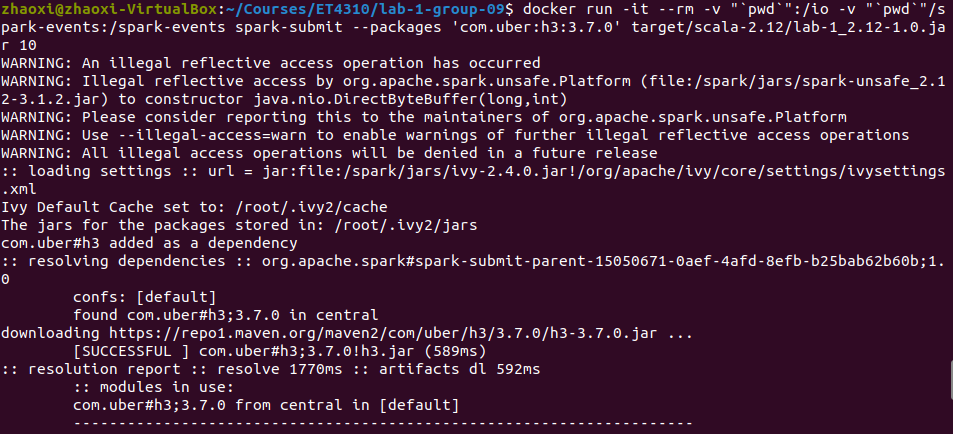
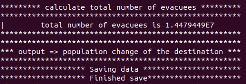

# Lab 1 Report

 


> "More people died in the struggle against water than in the struggle against men." <p align="right">---- Pytheas Massiliensis, 350 BC</p>  

As the Greek geographer noted of the Low Countries, the flood has been a serious issue that haunted people in the Low Land for hundreds of years.  Currently, as shown in the graph on the right side, approximately two-thirds of the land in the Netherlands is below sea level, it is still extremely vulnerable to flooding. 

This is the motivation of our work — Assume that all the flood control infrastructures in the Netherlands failed, and the sea level has risen a certain height. Residents living in the flooded areas need to be evacuated into cities above sea level. The goal of our project is to present a relocation plan for this situation.

## Usage
The structure of our project is:

```

├── build.sbt
├── project
│   └── build.properties
└── src
    └── main
        └── scala
            └── Lab1.scala
```

After cloning the code from the repository, navigate to the root directory by typing in the following command in the terminal:

```
cd directory_to_Lab1/lab-1-group-09
```

Then start the sbt container in the root folder, it should start an interactive sbt process. Here, we can compile the sources by writing the compile command.
```
docker run -it --rm -v "`pwd`":/root sbt sbt
sbt:Lab1 >compile
```
<p align="center">

</p>

<center> Running sbt </center>


Now we are set up to run our program! Consider an integer that represents the height of the rising sea level (unit: meter).<br/>
Use ` run height `  command to start the process and you could get information like the image below. This way of running the spark application is mostly used for testing.  Next, we are going to introduce you another way of building and running this Spark application which enables the developer to inspect the event log on the spark history server.  
```
sbt:Lab1 >run 5
```  

<p align="center">

</p>

<center> testing the application in sbt </center>


By using the ` spark-submit `  command, we set the application to run on a local Spark "cluster". Since we have already built the JAR, all you need to do is to run the code below:

```
docker run -it --rm -v "`pwd`":/io -v "`pwd`"/spark-events:/spark-events spark-submit --packages 'com.uber:h3:3.7.0' target/scala-2.12/lab-1_2.12-1.0.jar height
```
In which the last argument ` height ` represents the height of sea level rise. Then you could get information like the below image.

<p align="center">

</p>
<center> running Spark application using spark-submit command </center>


## Functional overview
> Introduce how you have approached the problem, and the global steps of your solution. 
### Step 1: Collecting valid data 
  * We first read in raw data from OpenStreetMap and group them by place. Then, invalid data are filtered out, the remainder are stored into dataframe [groupLessDF]. 
  * After calculating corresponding H3 index values, we get all the information we need in dataframe [h3mapdf]. Since we are going to re-use [h3mapdf] for the next process, it is stored in memory in order to get better performance.
  * The data set is divided into two dataframes : [harbourDF] for harbours, [placeDF] for other places.
### Step 2: Aggregating data
  * We defined function ` combineDF ` to combine data from OpenStreetMap and ALOS into [combinedDF]. 
  * Acquired elevation data from ALOS, we can determine whether a place is flooded based on the input ` height ` . The results are seperated into [floodDF] and [safeDF].
  * To make the application type-safe, we added ` Typecheck ` function to indicate correct input type and range for the users.
### Step 3: Matching the flooded region to the optimal shelter
  * We defined function ` findClosestDest ` for the following operations. There are two ways of implementing it: 
     1. Match the flooded place with all the safe places and compare the distances
     2. Narrow the search attempts to places within the same large H3 tile
  * [floodToSafe] dataframe stores information of each flooded city and its distances to the nearest safe city and harbour. 
### Step 4: Calculating evacuation plan
  * By comparing the distances to the city and the harbour, we divide the flooded places into two groups, namely:
     *  [near_city] places that are closer to a safe city 
     *  [near_harbour] places that are closer to a harbour.
  * Finally, we calculate the change of population for the plan according to the evacuation rules and output the result as ` .orc ` files.

> Take into consideration your robustness level (see Rubric), and what you had
> to do to make your answer as accurate as possible. Explain what information
> was missing and how you have mitigated that problem.

## Result

When the application finished, information showing on the screen is like this:
<p align = "center" >
 
</p>

Saved data:

```
+------------------------+------------+-----------+
|place                   |num_evacuees|destination|
+------------------------+------------+-----------+
|Aadorp                  |1520.0      |Enschede   |
|Aagtekerke              |1156.5      |Maastricht |
|Aagtekerke              |385.5       |Waterworld |
|Aalden                  |1222.5      |Enschede   |
|Aalden                  |407.5       |Waterworld |
|Aalsmeer                |16626.0     |Enschede   |
|Aalsmeer                |5542.0      |Waterworld |
|Aalsmeerderbrug         |375.75      |Enschede   |
|Aalsmeerderbrug         |125.25      |Waterworld |
|Aalst                   |1576.5      |Maastricht |
|Aalst                   |525.5       |Waterworld |
......

    +-----------+--------------+--------------+
    |destination|old_population|new_population|
    +-----------+--------------+--------------+
    |Tilburg    |199128.0      |3945939.25    |
    |Eindhoven  |226921.0      |690818.5      |
    |Waterworld |0.0           |3061754.0     |
    |Enschede   |148874.0      |533033.25     |
    |Ede        |72460.0       |4183614.5     |
    |Venlo      |64339.0       |230321.25     |
    |Apeldoorn  |141107.0      |1282945.5     |
    |Maastricht |120105.0      |131383.0      |
    |Roermond   |41225.0       |97623.0       |
    |Emmen      |56113.0       |1392288.75    |
    +-----------+--------------+--------------+
```

> Present the output of your program. Explain what could be improved (if 
> applicable).

## Scalability

> Give a concise analysis of the scalability of your solution. Identify in
> the various steps described previously how this affects the scalability.
>
> Example:
>   Steps A and B were initially performed the other way around, but 
>   since Step B performs a sort which involves a shuffle in the physical plan
>   of Spark, it was better to first apply the filter in Step A, and then sort.

## Performance

> Present performance measurements. You can obtain these from the Spark history
> server.

> Relate the measurements to your code and describe why specific steps take a
> relatively longer or shorter time w.r.t. the other steps.

