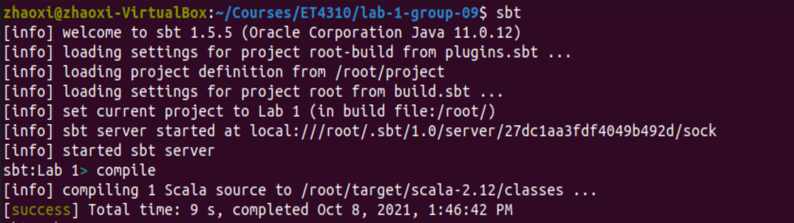

# Lab 1 Report

 

> "More people died in the struggle against water than in the struggle against men." <p align="right">---- Pytheas Massiliensis, 350 BC</p>  

As the Greek geographer noted of the Low Countries, flood has been a serious issue that haunted people in the Low Land for hundreds of years.  Currently, as shown in the graph on the right side, approximately two thirds of the land in the Netherlands is below sea level, it is still extremely vulnerable to flooding. 

This is the motivation of our work — Assume that all the flood control infrastratures in the Netherlands failed, and the sea level has rised a certain height. Residents living in the flooded areas need to be evacuated into cities above the sea level. The goal of our project is to present a relocation plan for this situation.

## Usage
The structure of our project is:

```

├── build.sbt
├── project
│   └── build.properties
└── src
    └── main
        └── scala
            └── Lab1.scala
```

After cloning the code from the repository, navigate to the root directory by typing in the following command in the terminal:

```
cd directory_to_Lab1/lab-1-group-09
```

Then start the sbt container in the root folder, it should start an interactive sbt process. Here, we can compile the sources by writing the compile command.
```
docker run -it --rm -v "`pwd`":/root sbt sbt
sbt:Lab1 >compile
```
<p align="center">

</p>

Now we are set up to run our program! Consider an integer that represent the height of the rising sea level (unit : meter).<br/>
Use ` run height `  command to start the process and you could get infomation like this:  
```
sbt:Lab1 >run 5
```  

<p align="center">

</p>

Another way of using the program is by submitting it to a local Spark cluster. 

## Functional overview
~~The objects and functions we defined are: ~~
~~```
├── object Lab1 
│   └── main
|   └── readOpenStreetMap(df:DataFrame) : (DataFrame,DataFrame)
|   └── readALOS(alosDF:DataFrame):DataFrame
|   └── combineDF(df1:DataFrame,df2:DataFrame,riseMeter:Int):(DataFrame,DataFrame)
|   └── findClosestDest(floodDF:DataFrame,safeDF:DataFrame,harbourDF:DataFrame)
└── h3helper: contains processes related to h3
    └── toH3func(lat:Double,lon:Double,res:Int):String
    └── getH3Distance(origin:String,des:String):Int
            
```

  
> Introduce how you have approached the problem, and the global steps of your
solution. 


  
  
  
> Example:
>
> ### Step 1: Preparing the data
>
> * We want to be as type-safe as possible so we've declared a case class X
>   with the fields y and z. 
> * We are now able to load the ORC file into the DataSet\[X\].

> Take into consideration your robustness level (see Rubric), and what you had
> to do to make your answer as accurate as possible. Explain what information
> was missing and how you have mitigated that problem.

## Result
 
> Present the output of your program. Explain what could be improved (if 
> applicable).

## Scalability

> Give a concise analysis of the scalability of your solution. Identify in
> the various steps described previously how this affects the scalability.
>
> Example:
>   Steps A and B were initially performed the other way around, but 
>   since Step B performs a sort which involves a shuffle in the physical plan
>   of Spark, it was better to first apply the filter in Step A, and then sort.

## Performance

> Present performance measurements. You can obtain these from the Spark history
> server.

> Relate the measurements to your code and describe why specific steps take a
> relatively longer or shorter time w.r.t. the other steps.

